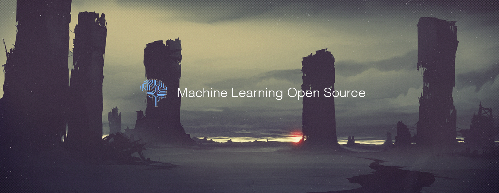

# Machine Learning Top 10 Open Source Projects for the Past Month (v.May 2018)

</a>

For the past month, we ranked nearly 250 Machine Learning Open Source Projects to pick the Top 10. 
We compared projects with new or major release during this period. Mybridge AI ranks projects based on a variety of factors to measure its quality for professionals.

* Average number of Github stars in this edition: 979 ⭐️
* Topics: ICLR 2018, Game Research, DeepLearn, Image Translation, Visualization, Text Generation, Self Driving Car, NLP, Video Loader

Open source projects can be useful for programmers. Hope you find an interesting project that inspires you.

 

### Course of the month:

[A) Beginners: Data Science A-Z™: Real-Life Data Science Exercises Included.](http://bit.ly/2rsWwuu) [11,909 recommends, 4.5/5 stars]

[B) Deep Learning: Advanced Computer Vision.](http://bit.ly/2wq4Vnz) [2,166 recommends, 4.7/5 stars]

 

## Rank 1
### [Progressive_growing_of_gans: Progressive Growing of GANs for Improved Quality, Stability, and Variation [★2508]](https://github.com/tkarras/progressive_growing_of_gans?utm_source=mybridge&utm_medium=blog&utm_campaign=read_more)

 

## Rank 2
### [ELF: An Extensive, Lightweight, and Flexible platform for game research. We have used it to build our Go playing bot, ELF OpenGo, which achieved a 14-0 record versus four global top-30 players [★1559]](https://github.com/pytorch/elf?utm_source=mybridge&utm_medium=blog&utm_campaign=read_more)

 

## Rank 3
### [DeepLearn: Implementation of research papers on Deep Learning+ NLP+ CV in Python using Keras, Tensorflow and Scikit Learn. [★1275]](https://github.com/GauravBh1010tt/DeepLearn?utm_source=mybridge&utm_medium=blog&utm_campaign=read_more)

 

## Rank 4
### [MUNIT: Multimodal Unsupervised Image-to-Image Translation [★795]](https://github.com/NVlabs/MUNIT?utm_source=mybridge&utm_medium=blog&utm_campaign=read_more)

 

## Rank 5
### [MMdnn: A set of tools to help users inter-operate among different deep learning frameworks. E.g. model conversion and visualization. Convert models between Caffe, Keras, MXNet, Tensorflow [★1467]](https://github.com/Microsoft/MMdnn?utm_source=mybridge&utm_medium=blog&utm_campaign=read_more)

 

## Rank 6
### [Textgenrnn: Python module to easily generate text using a pretrained character-based recurrent neural network. [★603]](https://github.com/minimaxir/textgenrnn?utm_source=mybridge&utm_medium=blog&utm_campaign=read_more)

 

## Rank 7
### [Donkey: A modular self driving car library for Python [★747]](https://github.com/wroscoe/donkey?utm_source=mybridge&utm_medium=blog&utm_campaign=read_more)

 

## Rank 8
### [TwinGAN: Unpaired Cross-Domain Image Translation with Weight-Sharing GANs [★232]](https://github.com/jerryli27/TwinGAN?utm_source=mybridge&utm_medium=blog&utm_campaign=read_more)

 

## Rank 9
### [Gluon-nlp: NLP made easy [★521]](https://github.com/dmlc/gluon-nlp?utm_source=mybridge&utm_medium=blog&utm_campaign=read_more)

 

## Rank 10
### [Nvvl: A library that uses hardware acceleration to load sequences of video frames to facilitate machine learning training [★294]](https://github.com/NVIDIA/nvvl?utm_source=mybridge&utm_medium=blog&utm_campaign=read_more)
