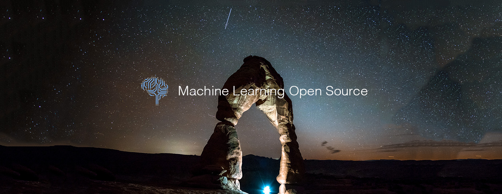

# Machine Learning Top 10 Open Source Projects for the Past Month (v.Jun 2018)

</a>

For the past month, we ranked nearly 250 Machine Learning Open Source Projects to pick the Top 10. 
We compared projects with new or major release during this period. Mybridge AI ranks projects based on a variety of factors to measure its quality for professionals.

* Average number of Github stars in this edition: 764 ⭐️
* Topics: NLP Architect, Video Classification, Mlflow, Gym Retro, Dragonfire, Opencv, Computer vision, Star GAN, Glow, Generative compression

Open source projects can be useful for programmers. Hope you find an interesting project that inspires you.

 

### Course of the month:

[A) Beginners: Python for Data Science and Machine Learning Bootcamp.](http://bit.ly/2Eso3R0)[21,763 recommends, 4.5/5 stars]

[B) Advanced: Artificial Intelligence: Reinforcement Learning in Python.](http://bit.ly/2HzWgyV)[1,768 recommends, 4.6/5 stars]

 

## Rank 1
### [Nlp-architect: NLP Architect by Intel AI Lab: Python library for exploring the state-of-the-art deep learning topologies and techniques for NLP [★1181]](https://github.com/NervanaSystems/nlp-architect?utm_source=mybridge&utm_medium=blog&utm_campaign=read_more)

 

## Rank 2
### [Video-nonlocal-net: Non-local Neural Networks for Video Classification [★590]](https://github.com/facebookresearch/video-nonlocal-net?utm_source=mybridge&utm_medium=blog&utm_campaign=read_more)

 

## Rank 3
### [Mlflow: Open source platform for the complete machine learning lifecycle [★1264]](https://github.com/databricks/mlflow?utm_source=mybridge&utm_medium=blog&utm_campaign=read_more)

 

## Rank 4
### [Retro: Retro Games in Gym [★903]](https://github.com/openai/retro/tree/develop?utm_source=mybridge&utm_medium=blog&utm_campaign=read_more)

 

## Rank 5
### [Dragonfire v1.0: An open-source AI assistant for Ubuntu based Linux distributions [★689]](https://github.com/DragonComputer/Dragonfire?utm_source=mybridge&utm_medium=blog&utm_campaign=read_more)

 

## Rank 6
### [FaceAI: A face, video, text detection and recognition project (Use auto translator: Chinese -> English). [★1478]](https://github.com/vipstone/faceai?utm_source=mybridge&utm_medium=blog&utm_campaign=read_more)

 

## Rank 7
### [Sod: An Embedded Computer Vision & Machine Learning Library (CPU Optimized & IoT Capable) [★554]](https://github.com/symisc/sod?utm_source=mybridge&utm_medium=blog&utm_campaign=read_more)

 

## Rank 8
### [StarGAN-Tensorflow: Simple Tensorflow implementation of StarGAN (CVPR 2018 Oral) [★381]](https://github.com/taki0112/StarGAN-Tensorflow?utm_source=mybridge&utm_medium=blog&utm_campaign=read_more)

 

## Rank 9
### [Glow: Compiler for Neural Network hardware accelerators [★602]](https://github.com/pytorch/glow?utm_source=mybridge&utm_medium=blog&utm_campaign=read_more)

 

## Rank 10
### [Generative-compression: TensorFlow Implementation of Generative Adversarial Networks for Extreme Learned Image Compression [★223]](https://github.com/Justin-Tan/generative-compression?utm_source=mybridge&utm_medium=blog&utm_campaign=read_more)

                    
