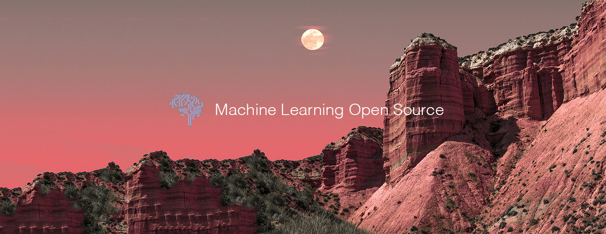

# Machine Learning Top 10 Open Source Projects for the Past Month (v.Jul 2018)

</a>

For the past month, we ranked nearly 250 Machine Learning Open Source Projects to pick the Top 10. 
We compared projects with new or major release during this period. Mybridge AI ranks projects based on a variety of factors to measure its quality for professionals.

* Average number of Github stars in this edition: 1,041⭐️
* Topics: DensePose, Image Classification, Mulit-Scale Training, Mobile AI Compute Engine, Satellite Imagery, NLP, Python Package, Word detection, NCRF, DALI

Open source projects can be useful for programmers. Hope you find an interesting project that inspires you.

 

### Course of the month:

[A) Beginners: Bayesian Machine Learning in Python: A/B Testing.](http://bit.ly/2KF1pv7) [1,037 recommends, 4.6/5 stars]

[B) Unsupervised Machine Learning Hidden Markov Models in Python.](http://bit.ly/2zfXQYb) [1,768 recommends, 4.6/5 stars]

 

## Rank 1
### [DensePose: A real-time approach for mapping all human pixels of 2D RGB images to a 3D surface-based model of the body [★2887]](https://github.com/facebookresearch/DensePose?utm_source=mybridge&utm_medium=blog&utm_campaign=read_more)

 

## Rank 2
### [Darts: Differentiable architecture search for convolutional and recurrent networks [★1117]](https://github.com/quark0/darts?utm_source=mybridge&utm_medium=blog&utm_campaign=read_more)

 

## Rank 3
### [SNIPER is an efficient multi-scale object detection algorithm [★1345]](https://github.com/mahyarnajibi/SNIPER?utm_source=mybridge&utm_medium=blog&utm_campaign=read_more)

 

## Rank 4
### [Mace: A deep learning inference framework optimized for mobile heterogeneous computing platforms. [★2109]](https://github.com/XiaoMi/mace?utm_source=mybridge&utm_medium=blog&utm_campaign=read_more)

 

## Rank 5
### [Robosat: Semantic segmentation on aerial and satellite imagery. Extracts features such as: buildings, parking lots, roads, water [★768]](https://github.com/mapbox/robosat?utm_source=mybridge&utm_medium=blog&utm_campaign=read_more)

 

## Rank 6
### [DecaNLP: The Natural Language Decathlon: A Multitask Challenge for NLP - Salesforce [★881]](https://github.com/salesforce/decaNLP?utm_source=mybridge&utm_medium=blog&utm_campaign=read_more)

 

## Rank 7
### [Magnitude: A fast, efficient universal vector embedding utility package. [★427]](https://github.com/plasticityai/magnitude?utm_source=mybridge&utm_medium=blog&utm_campaign=read_more)

 

## Rank 8
### [Porcupine: On-device wake word detection engine powered by deep learning. [★372]](https://github.com/Picovoice/Porcupine?utm_source=mybridge&utm_medium=blog&utm_campaign=read_more)

 

## Rank 9
### [Cancer metastasis detection with neural conditional random field (NCRF) [★289]](https://github.com/baidu-research/NCRF?utm_source=mybridge&utm_medium=blog&utm_campaign=read_more)

 

## Rank 10
### [DALI: A library containing both highly optimized building blocks and an execution engine for data pre-processing in deep learning applications [★418]](https://github.com/NVIDIA/dali?utm_source=mybridge&utm_medium=blog&utm_campaign=read_more)

