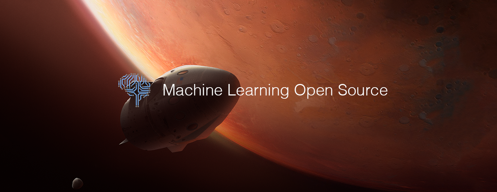

# Machine Learning Top 10 Open Source Projects for the Past Month (v.Oct 2018)

</a>

For the past month, we ranked nearly 250 Machine Learning Open Source Projects to pick the Top 10. 
We compared projects with new or major release during this period. Mybridge AI ranks projects based on a variety of factors to measure its quality for professionals.

* Average number of Github stars in this edition: 1,345 ⭐️
* Topics: Deep Learning, Tensorflow, Image Augmentation, Manga Colorization, Reinforcement Learning, Unity, Artificial Intelligence, Small Devices, Database

Open source projects can be useful for programmers. Hope you find an interesting project that inspires you.

 

### Course of the month:

[A) Beginners: Data Science, Deep Learning, & Machine Learning with Python.](http://bit.ly/2FbgIcv) [10,509 recommends, 4.5/5 stars]

[B) Advanced AI: Deep Reinforcement Learning in Python.](http://bit.ly/2DQxHjq) [1,137 recommends, 4.7/5 stars]

 

## Rank 1
### [Fastai: It  simplifies training fast and accurate neural nets using modern best practices [★8962]](https://github.com/fastai/fastai?utm_source=mybridge&utm_medium=blog&utm_campaign=read_more)

 

## Rank 2
### [Deepvariant: DeepVariant is an analysis pipeline that uses a deep neural network to call genetic variants from next-generation DNA sequencing data. [★1262]](https://github.com/google/deepvariant?utm_source=mybridge&utm_medium=blog&utm_campaign=read_more)

 

## Rank 3
### [Albumentations: fast image augmentation library and easy to use wrapper around other libraries [★1097]](https://github.com/albu/albumentations?utm_source=mybridge&utm_medium=blog&utm_campaign=read_more)

 

## Rank 4
### [MangaCraft: The current best semi-automatic manga colorization project on earth. [★583]](https://github.com/lllyasviel/MangaCraft?utm_source=mybridge&utm_medium=blog&utm_campaign=read_more)

 

## Rank 5
### [Holodeck: High Fidelity Simulator for Reinforcement Learning and Robotics Research. [★346]](https://github.com/byu-pccl/holodeck?utm_source=mybridge&utm_medium=blog&utm_campaign=read_more)

 

## Rank 6
### [Petastorm:  Uber ATG’s Data Access Library for Deep Learning [★253]](https://github.com/uber/petastorm?utm_source=mybridge&utm_medium=blog&utm_campaign=read_more)

 

## Rank 7
### [Ngx: Neural network based visual generator and mixer [★102]](https://github.com/keijiro/Ngx?utm_source=mybridge&utm_medium=blog&utm_campaign=read_more)

 

## Rank 8
### [AlphaAI: Use unsupervised and supervised learning to predict stocks [★90]](https://github.com/VivekPa/AlphaAI?utm_source=mybridge&utm_medium=blog&utm_campaign=read_more)

 

## Rank 9
### [Blueoil: Bring Deep Learning to small devices [★71]](https://github.com/blue-oil/blueoil?utm_source=mybridge&utm_medium=blog&utm_campaign=read_more)

 

## Rank 10
### [Tencent-ml-images: Largest multi-label image database; ResNet-101 model; 80.73% top-1 acc on ImageNet [★907]](https://github.com/Tencent/tencent-ml-images?utm_source=mybridge&utm_medium=blog&utm_campaign=read_more)

                    
