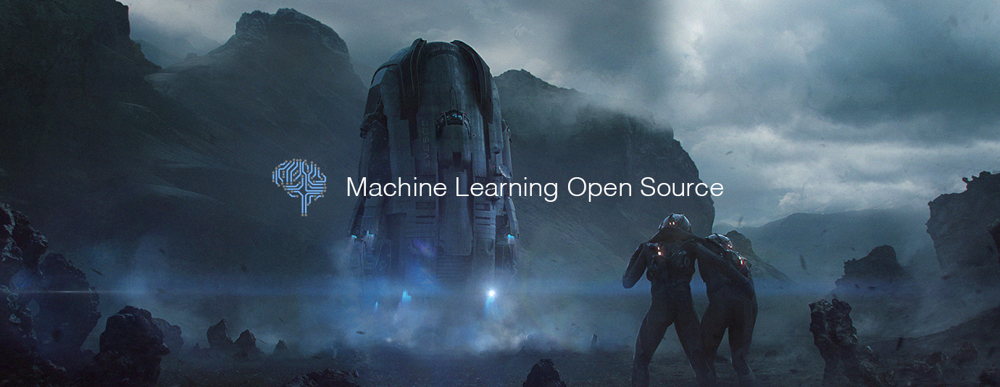

# Machine Learning Open Source of the Month (v.Dec 2018)

</a>

For the past month, we ranked nearly 250 Machine Learning Open Source Projects to pick the Top 10. 
We compared projects with new or major release during this period. Mybridge AI ranks projects based on a variety of factors to measure its quality for professionals.

* Average number of Github stars in this edition: 1,113 ⭐️
* Topics: NLP, Hentai, Applied RL, Reinforcement Learning, Deep Learning, Automl, Graph Networks, MAME RL Algorithm, Model Compression, R-CNN

Open source projects can be useful for programmers. Hope you find an interesting project that inspires you.

 

### Course of the month:

[A) Beginners: Machine Learning A-Z™: Hands-On Python & R In Data Science.](http://bit.ly/2oAaMA3) [63,713 recommends, 4.5/5 stars]

[B) Machine Learning with Javascript: Master Machine Learning from scratch using Javascript and TensorflowJS with hands-on projects.](http://bit.ly/2rvL7tt) [414 recommends, 4.7/5 stars]

 

## Rank 1
### [Pytext: A natural language modeling framework based on PyTorch [★2086]](https://github.com/facebookresearch/pytext?utm_source=mybridge&utm_medium=blog&utm_campaign=read_more)

 

## Rank 2
### [Jax: GPU- and TPU-backed NumPy with differentiation and JIT compilation. [★2289]](https://github.com/google/jax?utm_source=mybridge&utm_medium=blog&utm_campaign=read_more)

 

## Rank 3
### [Reaver-pysc2: Reaver: StarCraft II Deep Reinforcement Learning Agent. Modular DRL framework. Works with Gym, Atari, and MuJoCo as well. [★309]](https://github.com/inoryy/reaver-pysc2?utm_source=mybridge&utm_medium=blog&utm_campaign=read_more)

 

## Rank 4
### [PySyft: A Python library for secure, private Deep Learning. PySyft decouples private data from model training, using Multi-Party Computation (MPC) within PyTorch](https://github.com/OpenMined/PySyft?utm_source=mybridge&utm_medium=blog&utm_campaign=read_more)

 

## Rank 5
### [Bert-as-service: Mapping a variable-length sentence to a fixed-length vector using BERT model [★1127]](https://github.com/hanxiao/bert-as-service?utm_source=mybridge&utm_medium=blog&utm_campaign=read_more)

 

## Rank 6
### [Image-super-resolution: Keras implementation of the Residual Dense Network for super scaling images. [★222]](https://github.com/idealo/image-super-resolution?utm_source=mybridge&utm_medium=blog&utm_campaign=read_more)

 

## Rank 7
### [Transparent_latent_gan: Use supervised learning to illuminate the latent space of GAN for controlled generation and edit [★1244]](https://github.com/SummitKwan/transparent_latent_gan?utm_source=mybridge&utm_medium=blog&utm_campaign=read_more)

 

## Rank 8
### [Self_driving_pi_car: A deep neural network based self-driving car, that combines Lego Mindstorms NXT with the computational power of a Raspberry Pi 3. [★654]](https://github.com/felipessalvatore/self_driving_pi_car?utm_source=mybridge&utm_medium=blog&utm_campaign=read_more)

 

## Rank 9
### [Gandissect: Pytorch-based tools for visualizing and understanding the neurons of a GAN. https://gandissect.csail.mit.edu/ [★800]](https://github.com/CSAILVision/gandissect?utm_source=mybridge&utm_medium=blog&utm_campaign=read_more)

 

## Rank 10
### [Aleph_star: Reinforcement learning with A* and a deep heuristic [★104]](https://github.com/imagry/aleph_star?utm_source=mybridge&utm_medium=blog&utm_campaign=read_more)

                    
